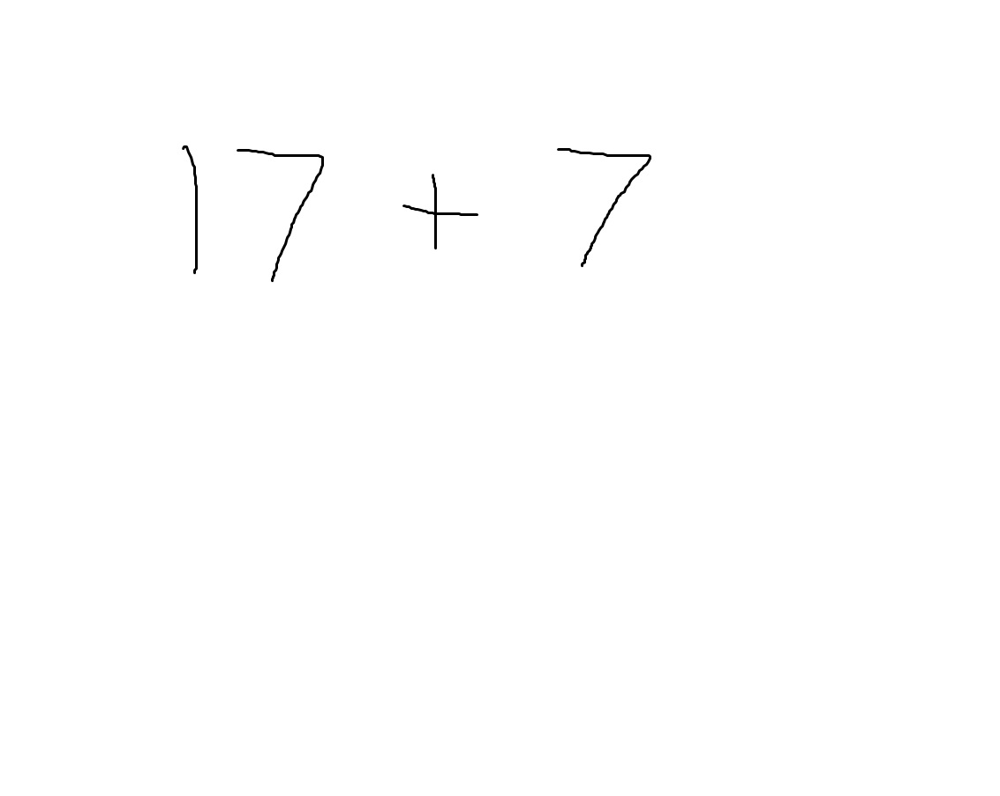
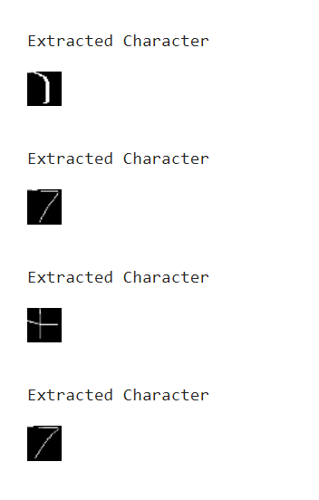
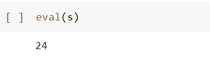

# Handwritten-Equation-Solve
Solving Handwritten Equation using Convolutional Neural Network

-The OpenCV library is used to extract lines and characters from an open image. This is done by first converting the image to grayscale and then applying a series of filters to identify the edges in the image. The lines and characters are then extracted from the image.

-The CNN model is then used to identify the characters in the image. The CNN model has been trained on a dataset of handwritten characters. The model predicts the probability of each character in the image. The character with the highest probability is then selected.

-The Python eval function is then used to evaluate the expression. The eval function takes the expression as a string and evaluates it using the Python interpreter. The result of the evaluation is then returned.
This approach can be used to solve a variety of handwritten equations. The accuracy of the approach depends on the quality of the image and the accuracy of the CNN model. However, this approach is a promising way to solve handwritten equations automatically.

# Requirements

1. OpenCV
2. Keras

# Introduction

In this project I have tried to use opencv and pretrain resnet50 model to evaluate handwritten
expressions. To test the project I have created handwritten expressions on paint and loaded the image
into Evaluate_Equation.ipynb

# Code Explained

**1. Extract_data.ipynb**

-Load the images from the dataset.

-Convert the images to grayscale.

-Apply image negation to the grayscale images.

-Find the contours in the images.

-Sort the contours by their bounding rectangles.

-Find the rectangle with the maximum area.

-Crop the image to the rectangle with the maximum area.

-Resize and reshape the cropped image to a 1D array.

-Append the class of the image (as a number from 0 to 12) to the 1D array.

-Store the 1D array in a list.

-Convert the list to a CSV file.

**2. Handwritten_train.ipynb**

-Import the CSV file using Pandas.

-Split the CSV file into images and labels. The images are the 1D arrays of pixel values, and the labels are the class numbers of the images.

-Convert the 1D images to 3D images. This is done by stacking the 1D images into a 3D array. The 3D array will have the dimensions (number of images, 28, 28, 3).

-Reshape the images to (number of images, 28, 28, 3). This is the required format for the ResNet50 model.

-Import the pretrained ResNet50 model.

-Add a Dense layer to the ResNet50 model. The Dense layer will have the number of output units equal to the number of classes in the dataset.

-Train the model. The model can be trained using the fit() method.

-Save the model. The model can be saved using the save_model() method.

**3. Evaluate_Equation.ipynb**

-Import the test image.

-Convert the image to grayscale and apply a threshold to convert it to a binary image.

-Find the contours in the binary image and sort them from left to right.

-Create a list of bounding rectangle coordinates for each contour.

-Iterate through the list of bounding rectangles and check if any of the boxes overlap.

-If overlapping boxes are found, crop the image using the bounding rectangle coordinates.

-Fit the model on the cropped image to train it.

-Use the eval function to evaluate the expression using the trained model.

# Results

The Resnet model is trained for 10 epochs with a batch size of 200 to an accuracy of 98%
Test image : 

Extracted Characters :

Evaluation Result :

